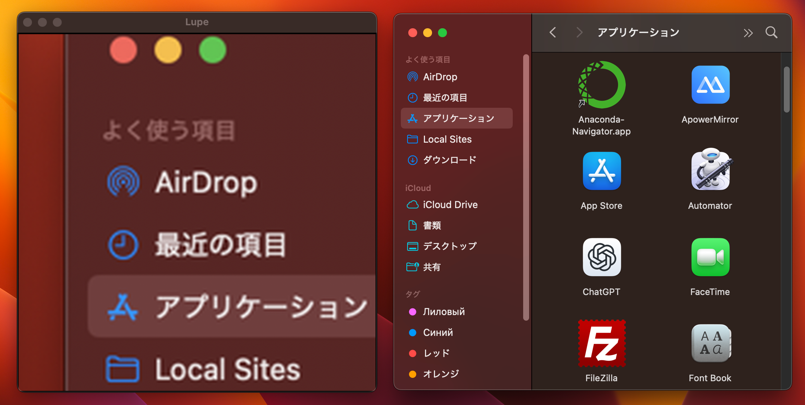

# 拡大ルーペビューア（Lupe）

## 概要

このアプリは、Python で作成した 画面拡大鏡（ルーペツール） です。
マウスカーソルの周囲をリアルタイムにキャプチャし、拡大表示することで、小さな文字や細かい部分を見やすくします。

主な機能
 1. リアルタイム拡大：マウスカーソル周囲を自動でキャプチャして表示
 2. 拡大倍率の設定：zoom で倍率を変更可能（例：3倍）
 3. 表示サイズの設定：window_size でウィンドウサイズを調整可能
 4. 更新速度の設定：refresh_ms で更新間隔をミリ秒単位で変更可能
 5. ESCキーで終了：簡単にアプリを閉じられる

動作イメージ
 1. アプリを起動すると、黒枠のウィンドウが表示されます。
 2. マウスカーソルの周囲がリアルタイムに拡大されて映し出されます。
 3. ESCキーを押すとアプリが終了します。


対象: 視覚に困難がある人  
対象分野: GUIアプリ  
使用ライブラリ: tkinter, PIL/Pillow

## デモ動画
[](https://www.youtube.com/watch?v=7SNJuBvXsqE)


## スクリーンショット
> `images/screenshot.png` 



- 実行環境: Python 3.x（macOS / Windows）
- 依存: `tkinter`, `pillow`（画像処理ライブラリ）


## セットアップ

```bash
pip install pillow
```

> `tkinter` は Python 標準に含まれているため追加インストール不要。


## 実行方法

```bash
python lupe.py
```

## ファイル構成
```
2_拡大ルーペビューア/
├── lupe.py
└── README.md   ← このファイル
└── images/
    └── screenshot.png   # 実行時の画面サンプル
```

## ライセンス
このリポジトリ内のコードは、個人ポートフォリオの実演・学習用途を想定しています。
