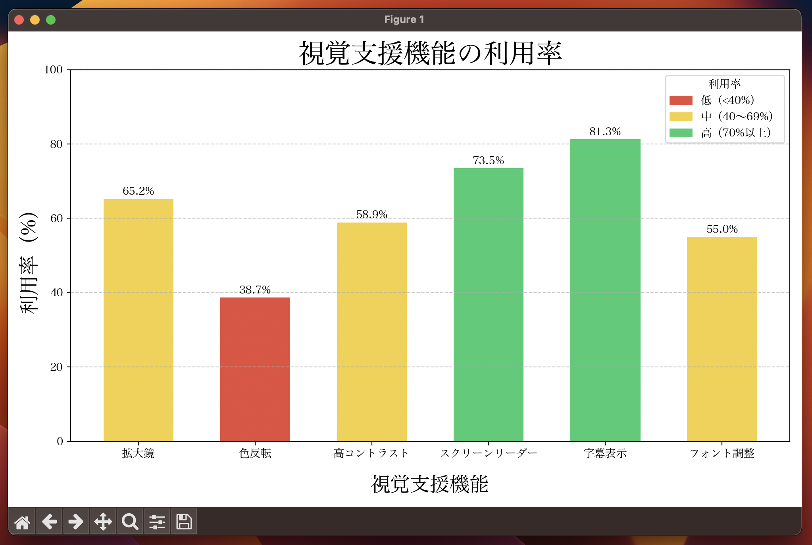

# 視覚支援機能の利用率グラフ

## 概要

このアプリは、Python（pandas / matplotlib）で作成した利用率可視化ツールです。

CSVファイルからデータを読み込み、利用率を色分けした棒グラフとして表示することで、傾向を直感的に把握できます。

主な機能
 1. CSVファイルの読み込み：利用率データを自動で取得
 2. 色分け表示：利用率の高低に応じて棒グラフの色を変更
 3. 凡例の表示：色ごとにラベルを付けて意味を明確化
 4. 日本語対応フォント：日本語ラベルが文字化けせずに表示可能

動作イメージ
 1. アプリを起動すると、CSVファイルから利用率データを読み込みます。
 2. データを棒グラフに変換し、利用率に応じて色分けして表示します。
 3. 凡例を見ながら、利用率の高低や全体の傾向を一目で理解できます。


対象: 教育・研究、データ分析用途  
対象分野: データ可視化  
使用ライブラリ: pandas, matplotlib

## デモ動画
[](https://www.youtube.com/watch?v=5_0Db2XDuL8)

## スクリーンショット
> `images/screenshot.png` 


- 実行環境: Python 3.x（macOS / Windows / Linux）
- 依存: pandas, matplotlib


## セットアップ
```bash
pip install pandas matplotlib
```

## 実行方法
```bash
python vision_support_graph.py
```

## ファイル構成（例）
```
4_vision_support_graph/
├── vision_support.csv
├── vision_support_graph.py
├── images/
│   └── screenshot.png   # 実行時のグラフサンプル
└── README.md            # このファイル
```

## ライセンス
このリポジトリ内のコードは、個人ポートフォリオの実演・学習用途を想定しています。
