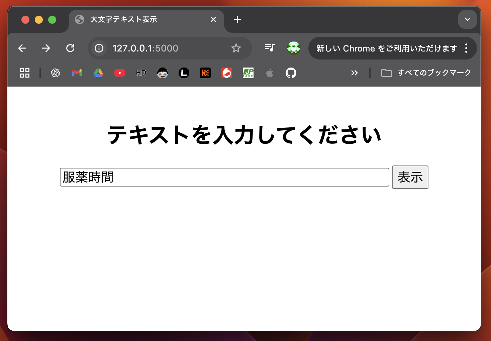

# 大文字テキスト表示（Flask）

## 概要

このアプリは、Python（Tkinter）で作成した 大文字表示ツールです。
入力したテキストを大きく表示し、弱視の方やプレゼン用に見やすくすることができます。

主な機能
 • テキスト入力：任意の文字を入力欄から入力
 • 大きな文字表示：画面中央に拡大したテキストを表示
 • フォントサイズ調整：設定により文字サイズを変更可能
 • シンプルなUI：誰でもすぐに使える直感的なデザイン

動作イメージ
 1. アプリを起動すると、テキスト入力欄が表示されます。
 2. 入力した文字を確定すると、大きな文字で画面中央に表示されます。
 3. プレゼンや日常生活で「見やすい表示」として活用できます。

## デモ動画
[](https://www.youtube.com/watch?v=KSR2g4imx18)

## スクリーンショット
> `images/screenshot.png` 



## セットアップ
```bash
pip install Flask
```

## 実行
```bash
python big_text.py
```
ブラウザで `http://127.0.0.1:5000/` を開く。フォームにテキストを入力→「表示」。


## ファイル構成
```
6_big_text/
├── big_text.py
├── README.md   　← このファイル
└── images/
    └── screenshot_1.png　　# 実行時の画面サンプル (入力画面)
    └── screenshot_2.png   # 実行時の画面サンプル (通常モード、高コントラストモード)
```
## ライセンス
このリポジトリ内のコードは、個人ポートフォリオの実演・学習用途を想定しています。
