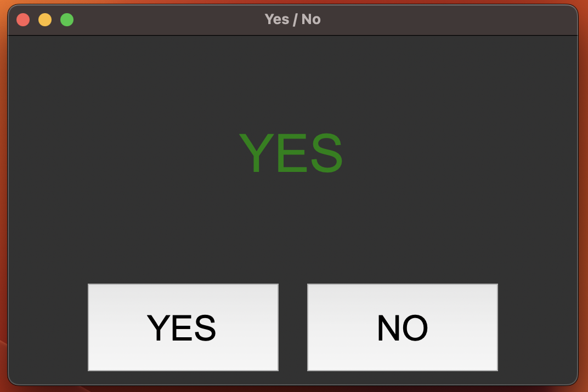

# Yes/No ボタン

## 概要

このアプリは、Python（Tkinter）で作成した Yes/No 選択ツール です。
ボタンまたはキーボード操作で「YES」または「NO」を選ぶと、効果音と共に画面に大きく表示され、直感的に意思決定をサポートします。

主な機能
 1. YES/NO ボタン：クリックで選択
 2. Enter / Escape キー操作：キーボードからも操作可能（Enter＝YES、Escape＝NO）
 3. 効果音再生：選択に応じた音声を再生（macOS の afplay または playsound）
 4. フルスクリーン表示：選択結果を画面中央に大きく表示

動作イメージ
 1. アプリを起動すると「YES」「NO」のボタンが表示されます。
 2. ボタンをクリック、または Enter / Escape キーを押して選択できます。
 3. 効果音と共に「YES」または「NO」が画面中央に大きく表示されます。

## デモ動画
[](https://www.youtube.com/watch?v=ErMKyJ3y_jM)

## スクリーンショット
> `images/screenshot.png`  



## セットアップ
任意: 効果音を使う場合だけ `playsound` を入れる。

```bash
pip install playsound   # 任意
```

プロジェクト直下に `yes.mp3` / `no.mp3` を置く。置かない場合はシステムのビープ音にフォールバック。


## 実行方法
```bash
python yes_no_button.py
```

## 注意事項
- `afplay` は macOS 専用。Windows では `playsound` が無い場合、ビープ音のみ。
- mp3 パスは `yes_no_button.py` と同じディレクトリに `yes.mp3` / `no.mp3` を配置する前提。


## ファイル構成
```
7_yes_no_button/
├── yes_no_button.py
├── yes.mp3
├── no.mp3
├── images/
│   └── screenshot_1.png   # 実行時の画面サンプル
│   └── screenshot_2.png   # 実行時の画面サンプル_全画面
└── README.md              # このファイル
```

## ライセンス
このリポジトリ内のコードは、個人ポートフォリオの実演・学習用途を想定しています。

