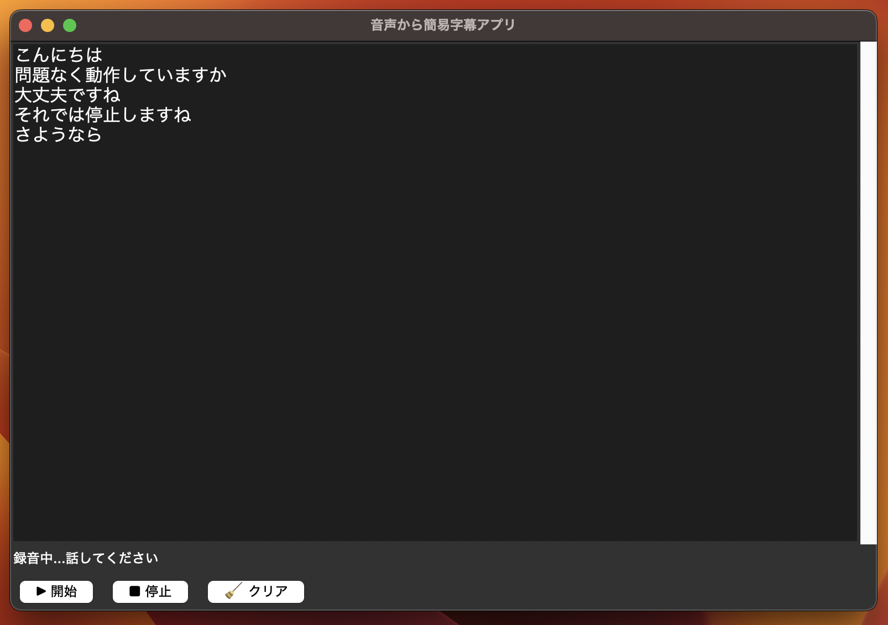

# 音声から簡易字幕アプリ

## 概要

マイク音声をリアルタイムで文字起こしし、字幕として表示するアプリです。  
認知症や聴覚障害を持つ人の会話補助や、授業・会議の補助ツールとして利用可能です。  

## デモ動画
[](https://www.youtube.com/watch?v=TOxVRh0raDo)


## スクリーンショット
> `images/screenshot.png`  



## セットアップ
推奨: 仮想環境を使用（任意）

```bash
# 仮想環境の作成と有効化
python3 -m venv .venv
source .venv/bin/activate   # macOS/Linux
# .venv\Scripts\activate    # Windows

# 必要ライブラリのインストール
pip install SpeechRecognition pyaudio
```

## 実行方法
```bash
python speech_to_subtitle.py
```

## ファイル構成（例）
```
8_speech_to_subtitle/
├── speech_to_subtitle.py
├── README.md             ← このファイル
└── images/
    └── screenshot.png    # 実行時の画面サンプル
```


## ライセンス
このリポジトリ内のコードは、個人ポートフォリオの実演・学習用途を想定しています。
