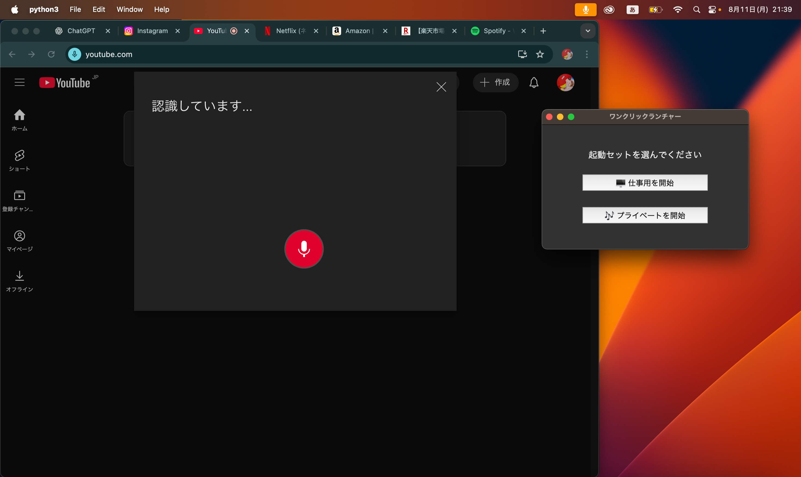

# Python ポートフォリオ Kubota Anna

## 概要
このポートフォリオは、**障害者支援** をテーマにした Python アプリ集。  
視覚障害、聴覚障害、ADHD、手の不自由な人など、さまざまなニーズに対応した支援ツールを収録している。  

---

## アプリ一覧

### 1. SOSベル（CLI版）
ターミナル上で赤背景・白文字の SOS 緊急サイン を点滅表示。  
対象: 聴覚に頼らずに緊急を視覚で伝えるニーズ  

対象分野: CLIアプリ  
使用ライブラリ: `colorama`  
フォルダ: `1_sos_bell_CLI/`  

---

### 2. 拡大ルーペビューア
マウス周辺をリアルタイムで拡大表示するシンプルなルーペ。  
対象: 視覚に困難がある人  

対象分野: GUIアプリ  
使用ライブラリ: `tkinter`, `PIL/Pillow`  
フォルダ: `2_lupe/`  

---

### 3. ワンクリックランチャー
仕事用・プライベート用にまとめてアプリやWebサイトを一括で起動できるGUIツール。  
ChatGPTや各種サービスは音声操作に対応しており、体の不自由な人向けにも有効。  

対象分野: GUIアプリ  
使用ライブラリ: `tkinter`, `subprocess`, `platform`, `webbrowser`  
フォルダ: `3_one_click_launcher/`  

仕事用モード:  

プライベート用モード:  

---

### 4. 視覚支援機能の利用率グラフ
拡大鏡・色反転・字幕表示などの利用率をCSVから読み込み、色分け棒グラフで可視化。  
対象: 教育・研究、データ分析用途  

対象分野: データ可視化  
使用ライブラリ: `pandas`, `matplotlib`  
フォルダ: `4_vision_support_graph/`  

---

### 5. 服薬リマインダー
薬の名前と時間を設定すると、指定時間後にポップアップ通知。単発通知タイプ。  
対象: 薬の飲み忘れ防止が必要な人  

対象分野: GUIアプリ  
使用ライブラリ: `tkinter`  
フォルダ: `5_medicine_reminder/`  

---

### 6. 大文字テキスト表示（Flask）
入力した文字を大きく表示し、音声読み上げや高コントラスト切替が可能なWebアプリ。  
対象: 視覚障害者、読み上げが必要な人  

対象分野: Webアプリ  
使用ライブラリ: `flask`  
フォルダ: `6_big_text_app/`  

入力画面:  

通常モード / 高コントラストモード:  

---

### 7. Yes/No ボタン
「YES」「NO」を大きなボタンで選択でき、音声・全画面表示で反応。  
キーボード操作（Enter / Esc）にも対応。  
対象: 手の操作が制限されている人、シンプルな入力が必要な場面  

対象分野: GUIアプリ + 音声処理  
使用ライブラリ: `tkinter`, `playsound`, `pathlib`, `subprocess`  
フォルダ: `7_yes_no_button/`  

通常モード:  

フルスクリーンモード:  

---

### 8. 音声から簡易字幕アプリ
マイク入力をGoogle音声認識でリアルタイムに字幕表示するGUIアプリ。  
対象: 聴覚障害者、会議や授業での支援  

対象分野: GUIアプリ + 音声処理  
使用ライブラリ: `tkinter`, `threading`, `speech_recognition`  
フォルダ: `8_speech_to_subtitle/`  

---

## 備考
このポートフォリオに掲載しているプログラムは、すべて AI（ChatGPT）と一緒に作成したものです。  
私は現在、プログラミングの超初心者であり、一人でゼロからアプリを完成させる段階には至っていません。  

一方で、以下の点をアピールできます：  

- **AI活用スキル**  
  実務でも活用が進んでいるAI（ChatGPT等）を積極的に取り入れ、アプリ開発の流れを体験しました。  

- **Pythonの基礎理解**  
  超基礎レベルですが、Pythonの文法、主要ライブラリの使い方、簡単なエラー対応を理解しました。  

- **学習意欲と継続力**  
  複数のアプリを完成させ、READMEやディレクトリ構成を含めて「ポートフォリオ」としてまとめ上げました。  
